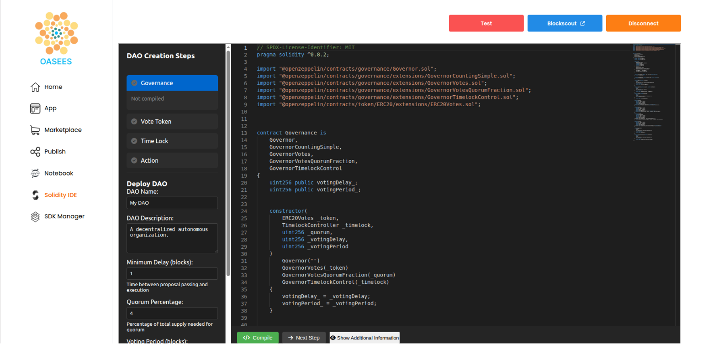
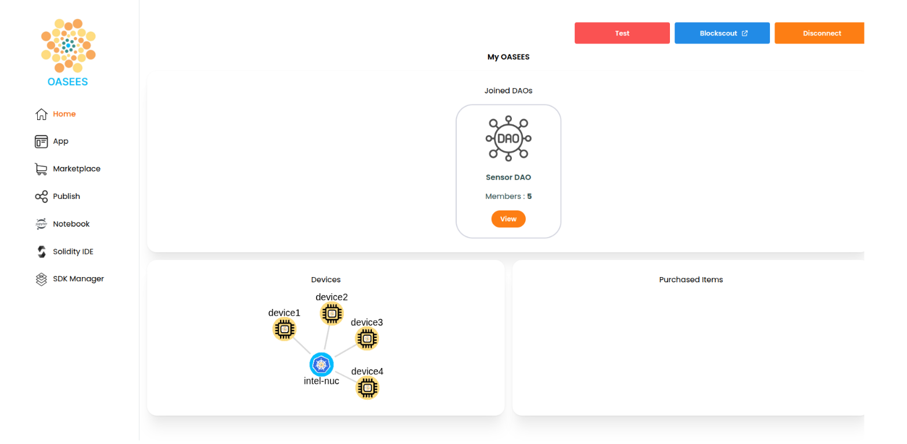
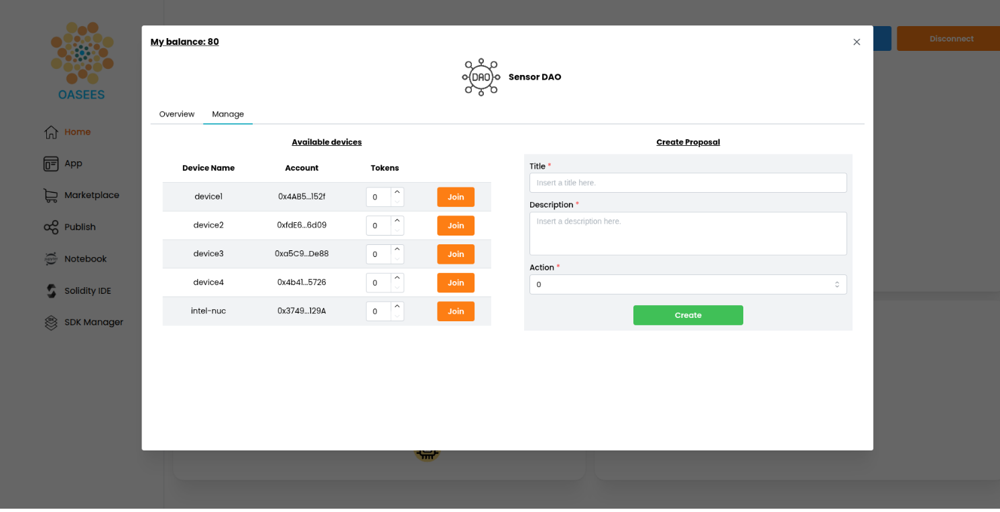

# DAO Operations

Create and manage Decentralized Autonomous Organizations (DAOs) for your device network.

## Creating a DAO

### Using the Solidity IDE



From the OASEES portal, you can create and deploy a DAO using the integrated Solidity IDE:

1. Navigate to the **Solidity IDE** section in the portal
2. Follow the **DAO Creation Steps**:
   - **Governance**: Configure voting mechanisms
   - **Vote Token**: Set up voting tokens
   - **Time Lock**: Define time-based constraints
   - **Action**: Configure action parameters
3. Click **Deploy DAO** with your chosen parameters:
   - **DAO Name**: Choose a descriptive name
   - **DAO Description**: Document your DAO's purpose
   - **Minimum Delay (Blocks)**: Time before proposal execution
   - **Quorum Percentage**: Minimum 'For' votes required for the proposal to pass

### Example Configuration

```
DAO Name: Sensor DAO
Description: A decentralized load balancing DAO
Minimum Delay: 1 block
Quorum Percentage: 4%
Percentage of total supply needed for votes to pass: 50%
```

## Interacting with Your DAO

After deployment, interact with your DAO from the **Home** page of the portal.




## Managing Device Membership

### Adding Devices to the DAO

1. Navigate to your DAO in the portal
2. Click **Manage** to access the management interface
3. View **Available devices** section
4. For each device, assign **Vote Tokens**:
   - Click the token amount field
   - Enter the desired number of tokens
   - Click **Save**




## Creating Proposals

Proposals can be created through:

* **Agent Configuration**: Automatic proposals based on metrics
* **Portal Interface**: Manually create proposals through the UI

{: .highlight}
If you want your devices to vote on a manually created proposal, make sure your proposal Title matches one of the device configuration ones (see [DAO Workflow](dao-workflow)). 


## Troubleshooting

### Proposal Not Executing

- Check if time lock period has passed
- Verify quorum was reached
- Ensure approval threshold was met
- Check blockchain transaction status

### Device Can't Vote

- Verify device has vote tokens
- Check device is DAO member
- Ensure Metamask is properly configured
- Verify blockchain connection

## Related Video

- [5.Dao-creation-device-membership.mp4](https://nocncsrd.sharepoint.com/:v:/r/sites/OASEES2/Shared%20Documents/WP5/OASEES%20STACK%20%26%20SDK%20GUIDE/6.Dao-creation-device-membership.mp4?csf=1&web=1&e=SXqElh)

## Next Steps

[Back to Telemetry](telemetry) | [Continue to DAO Workflow](dao-workflow)
