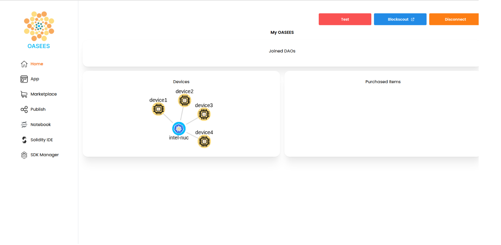

# Join Devices to the Cluster

Add worker-agent nodes to your OASEES cluster.

## Prerequisites

- OASEES stack running on master node
- Join token from master node (from `oasees-sdk get-token`)
- Linux-based worker devices
- VPN connection active on all devices

## Steps to Join a Device

### 1. Install oasees-sdk on Each Device

On each worker device, install the SDK:

```bash
pip install oasees-sdk
```

### 2. Join the Device

Use the token obtained from the master node:

```bash
oasees-sdk join --ip <YOUR_MASTER_IP> --token <TOKEN>
```

Replace:
- `<YOUR_MASTER_IP>` with your master node's IP address
- `<TOKEN>` with the token from `oasees-sdk get-token`

Example:

```bash
oasees-sdk join --ip 192.168.1.100 --token eyJhbGc...
```

### 3. Verify Devices in Portal

The devices will be visible in the OASEES portal once they've successfully joined.

Navigate to the Home page of the portal at `http://<YOUR_MASTER_IP>:30000` and you should see your devices displayed in the network topology.



## Checking Device Status

From the master node, verify devices are registered:

```bash
kubectl get nodes
```

You should see all your worker nodes listed with `Ready` status.

## Troubleshooting

### Device Not Appearing

- Verify VPN connection on the device
- Check that the token hasn't expired
- Ensure the master IP is accessible from the worker device
- Check firewall rules

### Join Command Fails

- Verify oasees-sdk is properly installed
- Ensure the device is running Linux
- Check network connectivity to master: `ping <MASTER_IP>`

## Related Video

- [2.join-devices-to-cluster.mp4](https://nocncsrd.sharepoint.com/:v:/r/sites/OASEES2/Shared%20Documents/WP5/OASEES%20STACK%20%26%20SDK%20GUIDE/3.join-devices-to-cluster.mp4?csf=1&web=1&e=zSA1H8)

## Next Steps

[Back to Stack Installation](stack-installation) | [Continue to Sample Application](sample-application)
