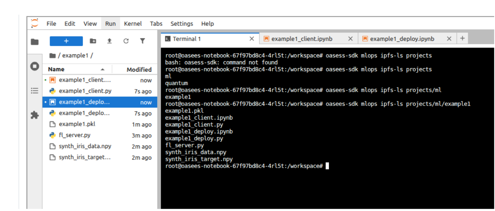

# MLops & Federated Learning

Train machine learning models using federated learning across your device network, keeping data local to each device.

## Overview

OASEES MLops utilities support:
- Data preparation and synthetic data generation
- Federated learning with PyTorch or TensorFlow
- Model deployment for inference
- IPFS-based model storage

View all MLops commands:

```bash
oasees-sdk mlops
```

## Data Preparation

### Prerequisites

Data must be:
- In NumPy format (`.npy` files)
- Split into features and labels (two separate files)
- Located on each device that will participate in training

### Prepare Dataset

On each device with training data:

```bash
oasees-sdk mlops prepare-dataset samples.npy labels.npy
```

{: .important }
> **Order matters**: First file must be samples/features, second file must be labels.

This command:
1. Creates synthetic data with the same shape
2. Uploads synthetic data to IPFS (for pipeline creation)
3. Moves original data to a mount location (data never leaves the device)
4. Registers the device as having training data

### Example: Iris Dataset

Download sample federated learning data:

```python
# download_sample_fl_data.py
# Available at: https://github.com/oasees/Oasees-Sample-app

# Run on each device
python download_sample_fl_data.py
```

This creates `poc_fl_data/` containing:
- `iris_data.npy` (features)
- `iris_target.npy` (labels)

Prepare the dataset:

```bash
cd poc_fl_data
oasees-sdk mlops prepare-dataset iris_data.npy iris_target.npy
```

### Check Available Data

List devices with prepared data:

```bash
oasees-sdk mlops fl-data-nodes
```

Example output:

```
iris_data.npy,iris_target.npy,device1
iris_data.npy,iris_target.npy,device2
```

## Creating Training Pipelines

### Using Example Templates

OASEES provides example federated learning projects:

```bash
# PyTorch example
oasees-sdk mlops init-example-pytorch example1

# TensorFlow example
oasees-sdk mlops init-example-tensorflow example1
```



This creates a project folder with:
- `<project>_client.ipynb`: Training pipeline notebook
- `<project>_deploy.ipynb`: Deployment pipeline notebook

### Using Custom Templates

For custom models:

```bash
oasees-sdk mlops init-project my-custom-project
```

This creates templates you must populate with:
- Your model architecture
- Training logic
- Evaluation metrics
- Data preprocessing

### Pipeline Development Workflow

1. **Open Notebook**: Access Jupyter from the OASEES portal
2. **Edit Training Pipeline**: Modify `<project>_client.ipynb`
3. **Test with Synthetic Data**: Run notebook to validate logic
4. **Edit Deployment Pipeline**: Modify `<project>_deploy.ipynb`
5. **Test Deployment**: Run deployment notebook
6. **Verify in IPFS**: Check pipelines are stored

The notebooks perform local validation with synthetic data before actual federated training.

### Verify Pipeline Storage

```bash
oasees-sdk mlops ipfs-ls projects/ml/<project_name>
```

You should see:
- `<project_name>_client.py`
- `<project_name>_deploy.py`
- Synthetic data files
- Saved models (after training)

## Starting Federated Learning

### Basic Command

```bash
oasees-sdk mlops start-fl \
    --project-name example1 \
    --data-files "iris_data.npy,iris_target.npy,device1:iris_data.npy,iris_target.npy,device2"
```

### Parameters

| Parameter | Description | Default |
|-----------|-------------|---------|
| `--project-name` | Name of the ML project | Required |
| `--data-files` | Data locations (see format below) | Required |
| `--min-clients` | Minimum clients for training | Number of data files |
| `--num-rounds` | Federated learning rounds | 5 |
| `--epochs` | Training epochs per client | 5 |

### Data Files Format

Format: `"features.npy,labels.npy,node:features.npy,labels.npy,node:..."`

- Comma-separated: features, labels, node name
- Colon-separated: different devices
- Must be in double quotes
- Spaces not allowed

Example for 3 devices:

```bash
--data-files "data.npy,labels.npy,device1:data.npy,labels.npy,device2:data.npy,labels.npy,device3"
```

{: .note }
> Use output from `oasees-sdk mlops fl-data-nodes` to construct the `--data-files` parameter.

### Advanced Example

```bash
oasees-sdk mlops start-fl \
    --project-name example1 \
    --data-files "iris_data.npy,iris_target.npy,device1:iris_data.npy,iris_target.npy,device2" \
    --num-rounds 10 \
    --epochs 10
```

### Monitor Training

Training progress will be displayed in the terminal. Components deployed:
- **FL Server**: Coordinates federated learning
- **FL Clients**: Run on each device with data

Check pods:

```bash
kubectl get pods | grep fl-
```

### After Training Completes

List trained models:

```bash
oasees-sdk mlops ipfs-ls projects/ml/example1
```

Models are timestamped: `example1_2025-07-24_06-16-15.pkl`

## Deploying Models for Inference

### Deploy a Trained Model

```bash
oasees-sdk mlops deploy-model \
    --project-name example1 \
    --model example1_2025-07-24_06-16-15.pkl
```

This:
1. Retrieves the model from IPFS
2. Wraps it in a Flask application (from deployment pipeline)
3. Deploys it to Kubernetes
4. Exposes it via a service

### Check Deployed Models

```bash
kubectl get pods,svc -l tag=model
```

Example output:

```
NAME                                READY   STATUS
pod/example1-model-xyz123           1/1     Running

NAME                     TYPE       PORT(S)
service/example1-model   NodePort   5000:31234/TCP
```

### Send Data for Inference

Use the provided script:

```python
# send_for_inference.py
import requests
import numpy as np

# Load your data
data = np.load('iris_data.npy')

# Send to model endpoint
response = requests.post(
    'http://<node-ip>:<port>/predict',
    json={'data': data.tolist()}
)

print(response.json())
```

Update `<node-ip>` and `<port>` based on kubectl output.

### Delete Deployed Models

```bash
kubectl delete pod,svc -l tag=model --force
```

## IPFS Utilities

### Upload to IPFS

```bash
# Upload file
oasees-sdk mlops ipfs-add myfile.pkl

# Upload directory
oasees-sdk mlops ipfs-add mydir/ --recursive
```

### Download from IPFS

```bash
oasees-sdk mlops ipfs-get <hash> output_path
```

### List IPFS Contents

```bash
# List all projects
oasees-sdk mlops ipfs-ls projects/ml

# List specific project
oasees-sdk mlops ipfs-ls projects/ml/example1
```

### Copy Files in IPFS

```bash
oasees-sdk mlops ipfs-cp source_path dest_path
```

### Remove from IPFS

```bash
oasees-sdk mlops ipfs-rm path/to/file
```

### Get IPFS Stats

```bash
oasees-sdk mlops ipfs-stat path/to/file
```


## Troubleshooting

### Training Fails to Start

- Verify all devices have prepared data
- Check `--data-files` format is correct
- Ensure enough device resources
- Review FL server logs

### Client Connection Issues

- Verify Kubernetes networking
- Check firewall rules
- Ensure VPN is active on all devices
- Review client pod logs

### Model Deployment Fails

- Check model file exists in IPFS
- Verify deployment pipeline is valid
- Ensure sufficient cluster resources
- Review deployment pod logs

### Inference Errors

- Verify input data format matches training
- Check model service is running
- Ensure port is accessible
- Review Flask application logs

## Example: Complete FL Workflow

```bash
# 1. Prepare data on devices
# (On device1)
oasees-sdk mlops prepare-dataset iris_data.npy iris_target.npy

# (On device2)
oasees-sdk mlops prepare-dataset iris_data.npy iris_target.npy

# 2. Create project (from notebook)
oasees-sdk mlops init-example-pytorch iris-classifier

# 3. Develop and test pipelines in Jupyter
# - Run iris-classifier_client.ipynb
# - Run iris-classifier_deploy.ipynb

# 4. Check data availability
oasees-sdk mlops fl-data-nodes

# 5. Start federated learning
oasees-sdk mlops start-fl \
    --project-name iris-classifier \
    --data-files "iris_data.npy,iris_target.npy,device1:iris_data.npy,iris_target.npy,device2" \
    --num-rounds 10 \
    --epochs 5

# 6. List trained models
oasees-sdk mlops ipfs-ls projects/ml/iris-classifier

# 7. Deploy model
oasees-sdk mlops deploy-model \
    --project-name iris-classifier \
    --model iris-classifier_2025-07-24_14-30-00.pkl

# 8. Check deployment
kubectl get pods,svc -l tag=model

# 9. Test inference
python send_for_inference.py

# 10. Cleanup when done
kubectl delete pod,svc -l tag=model --force
```

## Related Videos

- [7.fl-prepare-dataset.mp4](https://nocncsrd.sharepoint.com/:v:/r/sites/OASEES2/Shared%20Documents/WP5/OASEES%20STACK%20%26%20SDK%20GUIDE/8.fl-prepare-dataset.mp4?csf=1&web=1&e=Yo7yeL)
- [8.create-train-deploy-pipelines.mp4](https://nocncsrd.sharepoint.com/:v:/r/sites/OASEES2/Shared%20Documents/WP5/OASEES%20STACK%20%26%20SDK%20GUIDE/9.create-train-deploy-pipelines.mp4?csf=1&web=1&e=cdWs9n)
- [9.federated-learning.mp4](https://nocncsrd.sharepoint.com/:v:/r/sites/OASEES2/Shared%20Documents/WP5/OASEES%20STACK%20%26%20SDK%20GUIDE/10.federated-learning.mp4?csf=1&web=1&e=dflKIl)
- [10.deploy-model.mp4](https://nocncsrd.sharepoint.com/:v:/r/sites/OASEES2/Shared%20Documents/WP5/OASEES%20STACK%20%26%20SDK%20GUIDE/11.deploy-model.mp4?csf=1&web=1&e=uAX2lU)

## Additional Resources

- [Flower Framework Documentation](https://flower.dev/docs/)
- [OASEES Sample App Repository](https://github.com/oasees/Oasees-Sample-app)

---

{: .note }
> This completes the OASEES Stack & SDK Guide. For questions or issues, refer to the [OASEES documentation repository](https://github.com/oasees/documentation).
